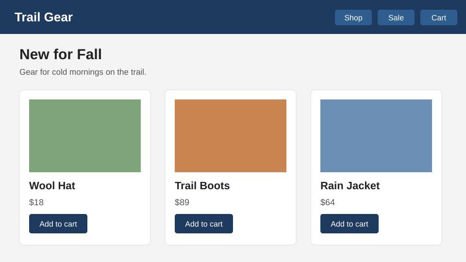
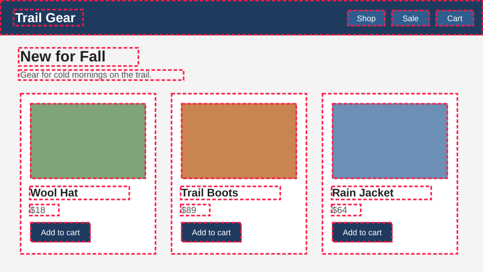
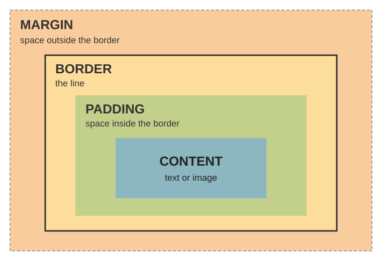
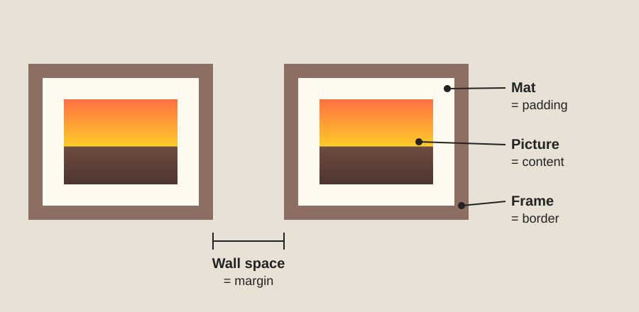
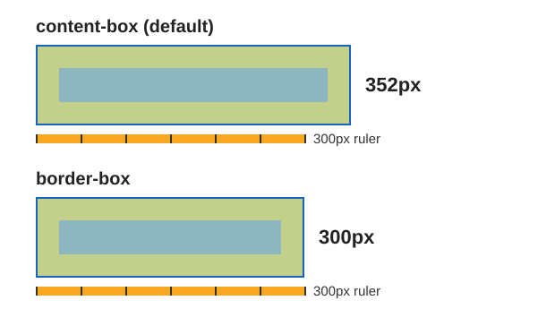

# Lesson 06a: The Box Model

## Web Design
### Medina County Career Center

---

# Today's Goals

**I can...**

1. Name the four layers of the box model
2. Use padding, border, and margin to control spacing
3. Figure out how wide a box is on the screen

---

# Where Are the Boxes?



How many boxes can you find on this page?

---

# Every Element Is a Box



Headers, buttons, pictures, text, cards: every one is a rectangle.

---

# The Box Model



Every box has four layers, from the inside out:

- **Content**: the text or image
- **Padding**: space *inside* the border
- **Border**: the line around the padding
- **Margin**: space *outside* the border

**Padding is inside. Margin is outside.**

---

# Think of a Framed Picture



The mat is inside the frame. The wall space is outside it.

---

# Box Model Properties

```css
.card {
  padding: 1.5rem;            /* inside space (rem) */
  border: 2px solid #1565c0;  /* width, style, color (px) */
  border-radius: 8px;         /* rounded corners */
  margin: 1rem;               /* outside space (rem) */
}
```

**Shorthand:** values go clockwise from the top
- `1rem` → all 4 sides
- `1rem 2rem` → top and bottom, left and right
- `1rem 2rem 3rem 4rem` → top, right, bottom, left

---

# Predict It

```css
.card {
  width: 300px;
  padding: 24px;
  border: 2px solid #1565c0;
}
```

How wide is this card on the screen?

**Write down your guess.**

---

# Answer: 352px

By default, padding and border are **added on top of** the width:

**300** + 24 + 24 + 2 + 2 = **352px**



**The fix:** `* { box-sizing: border-box; }` at the top of your CSS. Now 300px means 300px.

---

# Whose Margin Is It?

```css
.card h2 {
  margin-top: 0;   /* the heading's margin, not the card's */
}
```

- The `<h2>` inside a card is its **own box** with its own margin
- The heading's margin is outside **the heading**, but still inside **the card**
- So it shows up as extra white space at the top of the card
- Browsers give headings a top margin by default. This rule removes it.

**A margin always belongs to one box.**

---

# Seeing the Boxes

**Way 1: The X-ray line.** Put this at the top of your CSS:

```css
* { outline: 1px solid red; }   /* remove when done */
```

**Way 2: Developer Tools** in VS Code Live Preview:

| Color | Layer |
|---|---|
| Blue | Content |
| Green | Padding |
| Yellow | Border |
| Orange | Margin |

---

# Today's Plan

1. **Walkthrough, Sections 1–6:** type the CSS into `boxPractice_Starter.html` as we go
2. **Frame Task** (`html06_FrameTask.html`): frame three pictures and answer four questions
3. **Finished early?** Go back to `html05_DIYTask.md`

**Tomorrow:** display, hover effects, and position (Lesson 06b)
