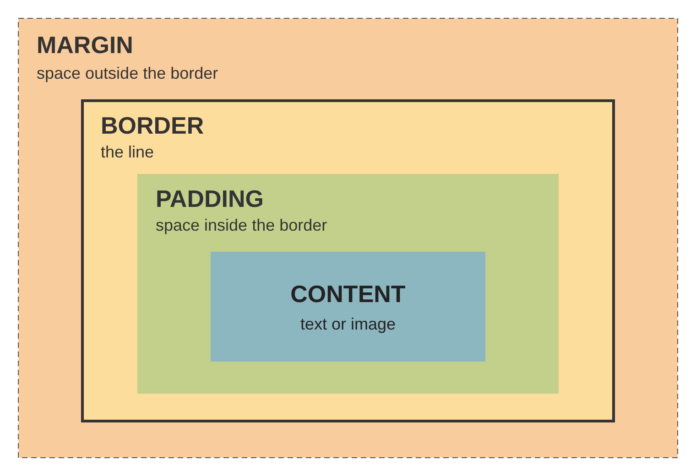

# Lesson 06b: Display, Hover, and Position

## Web Design
### Medina County Career Center

---

# Quick Review: The Box Model



- **Padding** is inside the border
- **Margin** is outside the border
- `box-sizing: border-box` keeps widths honest
- `max-width` + `margin: 0 auto` centers a box

---

# Display Property

| Display | New line? | Width/height work? | Example |
|---------|-----------|--------------------|---------|
| block | Yes | Yes | `<div>`, `<p>`, `<section>` |
| inline | No | No | `<a>`, `<span>` |
| inline-block | No | Yes | nav buttons, cards in a row |
| none | Hidden | n/a | hide an element |

```css
nav a {
  display: inline-block;     /* Make each link behave like a small box.
                              Unlike a normal inline element, the box can
                              properly use padding, width, and height. */
  padding: 0.5rem 1rem;        /* Create space inside the link's box:
                              0.5rem above and below
                              1rem to the left and right */
}
```

---

# Hover Effects: :hover

The rule applies **only while the mouse is on the element**.

```css
nav a {
  background-color: #1565c0;
}

nav a:hover {
  background-color: #ff9800;   /* changes on hover */
}
```

Hover tells visitors "you can click this."

---

# Position Property

| Value | What it does |
|-------|--------------|
| static | Default. Normal flow. |
| relative | Stays in flow. Anchor for absolute children. |
| absolute | Leaves flow. Placed inside nearest positioned parent. |
| fixed | Leaves flow. Stuck to the window while scrolling. |
| sticky | Scrolls, then sticks at its `top` value. |

`top`, `right`, `bottom`, `left` move positioned boxes.
`z-index`: higher number = on top.

---

# Sticky Header

```css
header {
  position: sticky;
  top: 0;                     /* stick at the top */
  z-index: 10;                /* stay on top */
  background-color: #0d2a4a;  /* solid, so content doesn't show through */
}
```

Sticky keeps its space on the page. A fixed header leaves the flow and covers the top of your content.

---

# Key Takeaways

- **Box model** = content + padding + border + margin
- **Padding** is inside, **margin** is outside
- `box-sizing: border-box` keeps widths honest
- `max-width` + `margin: 0 auto` centers a box
- **display** changes how boxes flow; **:hover** styles the mouse-over state
- **position** is for special jobs: sticky headers, badges, fixed buttons
- The **X-ray line** and **Developer Tools** show every box

---

# This Lesson

1. **Walkthrough, Sections 7–10:** display, hover, and position on the practice page
2. **Task** (`html06_Task.html`): fill in the TODOs
3. **DIY** (`html06_DIYTask.md`): set up your `DiyWebsite_Lastname` folder, then add spacing, nav buttons with hover, a sticky header, and gallery cards to your website
